Since 2017, [GEOTEC](https://geotec.uji.es/) members have adopted reproducible practices in our research. We often undertake computationally oriented, data-intensive work, so coding and data analysis are core activities. Enabling reproducibility, however, is a long process, with many phases of trial and error. Over the years we have learned a great deal and implemented progressively more actions and tools to improve reproducibility.

Reproducibility requires more than technical competence. Technical skills are important, of course, but the greatest challenge is changing a research team's habits. This requires time, ongoing training, support, coaching --especially for early-stage researchers-- build the ability to work in a reproducible manner. These efforts can have an immediate impact on their next paper and, more importantly, foster a long-term commitment to transparency, integrity, honesty and reproducibility that benefits their future research careers.

GEOTEC has not yet established a consistent policy to improve reproducibility practices as [other groups have done](https://lorenabarba.com/gallery/reproducibility-pi-manifesto/). It is time to reflect a bit on this by taking as an example a recent scientific article to show how we GEOTEC put open science and reproducible practices at work. But this reflection is to put in writing a wish: beyond an exceptional case of good practices like the example below, we would like to extend it to all members, current and future, so that this post is a kind of initial commitment regarding the expected way of working at GEOTEC.

We use the following published journal article as a case study. I set aside its scientific contribution to focus on the **HOW**, i.e., how we (the authors, led by the first author) conducted the research reported in the paper using open and reproducible practices.

> Miguel Matey-Sanz, Alberto González-Pérez, Sven Casteleyn, Carlos Granell. [Implementing and evaluating the Timed Up and Go test automation using smartphones and smartwatches](https://doi.org/10.1109/JBHI.2024.3456169). IEEE Journal of Biomedical and Health Informatics, 28(11): 6594-6605, 2024.

@fig-roadmap-start illustrates the stops along the road to open science and reproducibility that we followed in this case study. Each stop is described in more detail below.

::: column-screen-inset-right
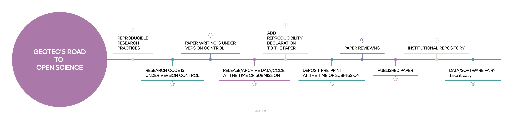{#fig-roadmap-start}
:::

## Stop: we plan with open science & reproducibility in mind

Most of your time is about conducting your research tasks and selecting and using the tooling and methods required (@fig-roadmap-planning). We, for instance, write code or use supporting tools for data collection, data analysis and data visualization. We programmatically run models and machine learning algorithms to produce plots and graphs. We also produce maps as we explore lots of geospatial datasets. Our code research is often experimental and iterative, and demands to work with notebooks, either in python or R, to interactively explore, transform, process, analyse and visualise datasets. We also build web applications or mobile apps, which follow a more general purpose software engineering practices.

So, when it comes to writing code, managing datasets, and so on, you need to follow basic recommendations and practices for making your resources more reproducible and easy to manage and document. There are excellent [practical guides published elsewhere](03-guidelines.qmd) with general recommendations for promoting reproducibility, research data management and open science. And, of course, [the selection of recommendations to apply before and during research](03-practices.qmd).

::: column-screen-inset-right
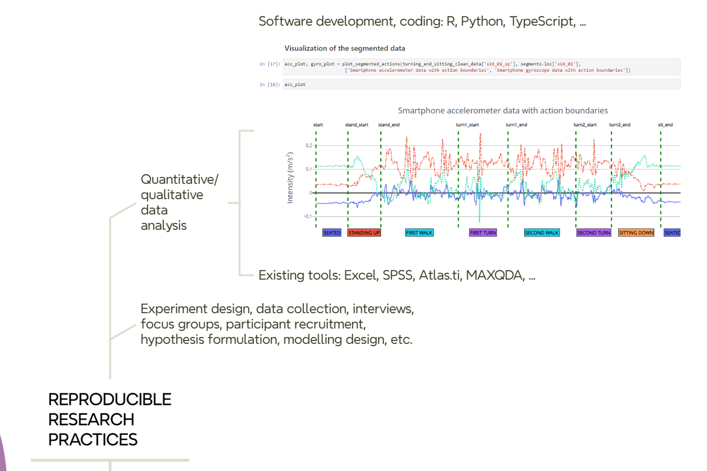{#fig-roadmap-planning}
:::

## Stop: we develop (code) using version control

In GEOTEC, the use of GitHub is the preferred choice. We have an [organization account](https://github.com/GeoTecINIT) where teams, members (developers), and repos associated with each team are publicly available. A team in Github is related to a research project or a line of research at GEOTEC, so the repositories within a team are connected to the same line of research or to a series of related projects.

Regardless of the programming language used, the folder structure of the repository, or whatever the intention (thesis, article, presentation, etc.) of the repository, there are some elements that are common to all repositories:

- A [README](https://github.com/GeoTecINIT/tug-automation-sp-sw-rp) file describes what the repository is about, what elements (code, data) it contains, license, how to reproduce it, specific conditions of the computational environment such as hardware devices or computation time demands if required.
- A [LICENSE](https://github.com/GeoTecINIT/tug-automation-sp-sw-rp/blob/main/LICENSE) file.
- A [requirements.txt](https://github.com/GeoTecINIT/tug-automation-sp-sw-rp/blob/main/requirements.txt) file or similar to declare external dependencies and versions.

It is a good idea to have a default license when a new project is created. Depending on the nature of the artifacts to be included, the default license can of course be replaced by another one that better captures the specific needs and restrictions of a project or software tool. Until stated otherwise, GEOTEC by default uses:

- Documents are licensed under the [Creative Commons Attribution 4.0 International License](https://creativecommons.org/licenses/by/4.0/). 
- Code, scripts, software resources are licensed under the [Apache License 2.0](https://www.apache.org/licenses/LICENSE-2.0). 
- Data is licensed under the [Open Data Commons Attribution License 1.0](https://opendatacommons.org/licenses/by/1-0/).

We use container technology [@moreau2023], but its adoption by GEOTEC members depends heavily on the technical background and ease of each researcher with docker, docker-compose, etc. In general, GEOTEC strongly encourages the use of this technology to facilitate the development, maintenance, and reproducibility of research code. We expect to have a `dockerfile` or `compose.yml` in each GitHub repository.

::: column-screen-inset-right
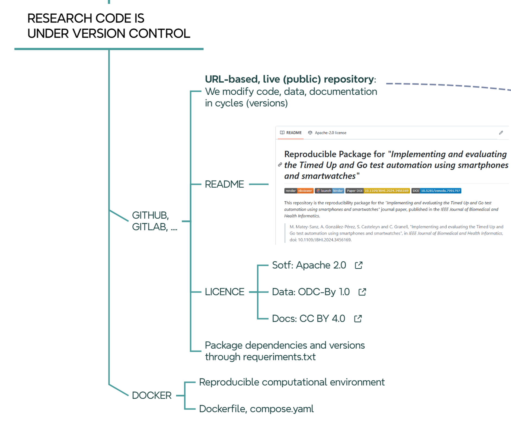{#fig-roadmap-vcs}
:::

## Stop: we write papers using version control

If research code is under control, so are research papers (@fig-roadmap-writing). For example, we extensively use the cloud-based [Overleaf](https://www.overleaf.com/) application for collaborative paper writing, which keeps track of every change or edit by authors using version control tools.

::: column-screen-inset-right
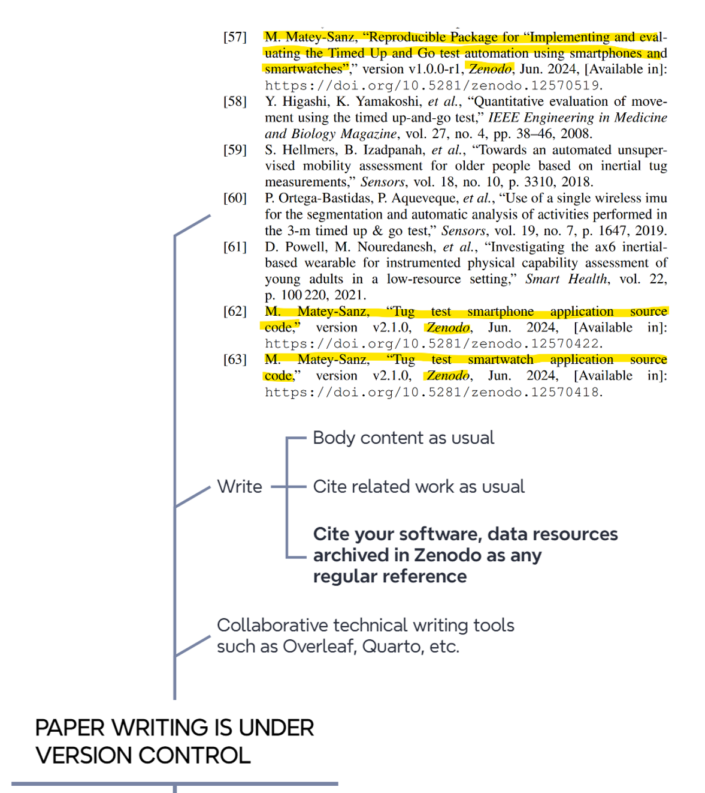{#fig-roadmap-writing}
:::

## Stop: we release/archive data/code at the time of submission

When the article is almost ready to be submitted, it is time to permanently archive the version of the software/data used/developed/reported in the article (@#fig-roadmap-archiving). In short, the idea is to create a static, read-only version of the repositories and deposit them on Zenodo. So each relevant GitHub repository for an article must have an associated Zenodo record. There are [websites that explain how to release a github repo as a Zenodo record](https://docs.github.com/en/repositories/archiving-a-github-repository/referencing-and-citing-content), so GitHub repo content and license are automatically exported to the Zenodo registry.

When creating [an entry on Zenodo](https://doi.org/10.5281/zenodo.12570519), either from scratch or from a GitHub repo, pay attention to the following fields.

- Within the `Basic information` section

    - Write in the `Description` field a similar text like this: 
    
    > Final code and data used for [ADD HERE PAPER, THESIS, PRESENTATION, DATA, etc]. The associated software repository in GitHub is [ADD LINK TO GITHUB REPO]

    - Write in `Additional Description` a similar text like this: 
    
    > The documents in this repository are licensed under a Creative Commons Attribution 4.0 International License. All contained code is licensed under the Apache License 2.0. The data used is licensed under a Open Data Commons Attribution License*. This text will appear in the yellow label of the Zenodo record under `Notes`.

    - Add license type to the ‘Licenses’ field

- Within the `Funding` section,  add grant numbers and project titles as acknowledged in the paper.

- Within the `Related work` section, add the following relations to connected resources

    - Select *Is version of* and add the source github repo as *Software* or *Software / Computational Notebook*.

    - Select *Is cited by* and add the journal article (when the article is finally accepted) as *Publication / Journal Article* or any other publication type from the list.

- Within the `Software` section, add the GitHub repository URL (same as above).

- Within the `Publication information` section, add the journal or conference publication details once the paper is published-

Once the Zenodo record is created and published, it is recommendable to add it to the [Universitat Jaume I Research Data](https://zenodo.org/communities/universitatjaumei/) community, which simply groups collections of datasets and publications from Universitat Jaume I researchers. To do so:

- Click on *Submit to communities* on the *Community* box on the right pane.
- Select *Universitat Jaume I Research Data* community in the pop-up window.

The community curator (university library) will then be notified to either accept or reject the new record.

::: column-screen-inset-right
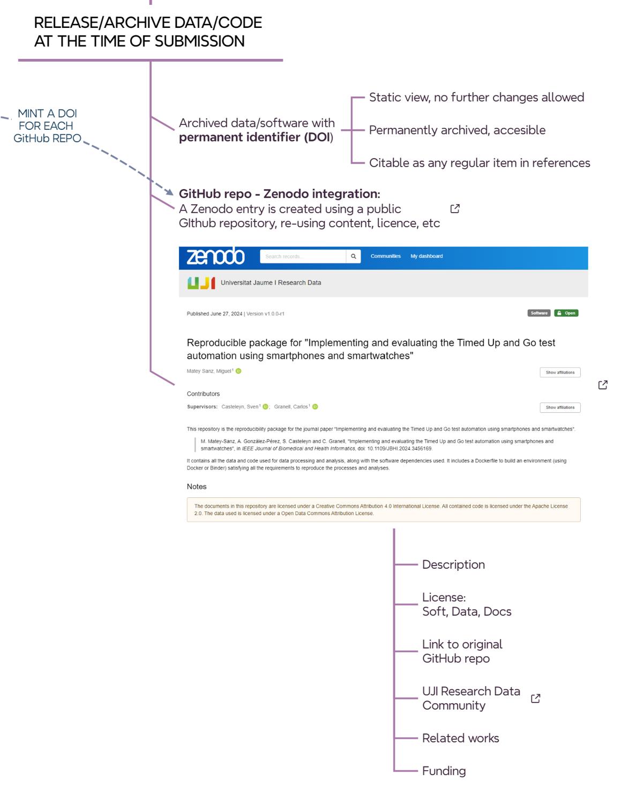{#fig-roadmap-archiving}
:::

## Stop: we add a reproducibility declaration to the paper

Another task to perform before submitting an article to a journal is to add a brief explanation of where the data and/or code used in the reported article are located (@fig-roadmap-dasa).

> “The collected datasets and code used for their processing, along with the machine learning models, the code for training them, and the data obtained from the experiments are available under permissive licences as a reproducible package (specifying required dependencies, software versions, and documentation) on Zenodo [57].”

> [57] M. Matey-Sanz, “Reproducible Package for “Implementing and evaluating the Timed Up and Go test automation using smartphones and smartwatches”, version v1.0.0-r1, Zenodo, Jun. 2024, [Available in]: [https://doi.org/10.5281/zenodo.12570519](https://doi.org/10.5281/zenodo.12570519).

The example above, taken from [the runing example](https://doi.org/10.1109/JBHI.2024.3456169), cites the previously archived research resources on Zenodo (*ref 57*), along with a mention of the selected permissive license. It is not included above but recommended to include a description of the hardware and software resources required for the analytical workflow, such as the hardware configuration (CPU/GPU, memory size, special devices, etc.), operating system, runtime or computational demand (can be omitted if negligible or very low), and the requirements configuration, i.e. a list of required libraries and versions. The latter can be omitted from the article if a `requirements.txt`, `environment.yml`, `Dockerfile`, `compose.yml` or similar together with a README file are part of the associated code repository (Github) that is connected to the corresponding Zenodo registry. For example, this is the [`requirements.txt`](https://github.com/GeoTecINIT/tug-automation-sp-sw-rp/blob/v1.0.0-r1/requirements.txt) file and [`Dockerfile`](https://github.com/GeoTecINIT/tug-automation-sp-sw-rp/blob/v1.0.0-r1/Dockerfile) file related to *ref 57* of the paper.

::: column-screen-inset-right
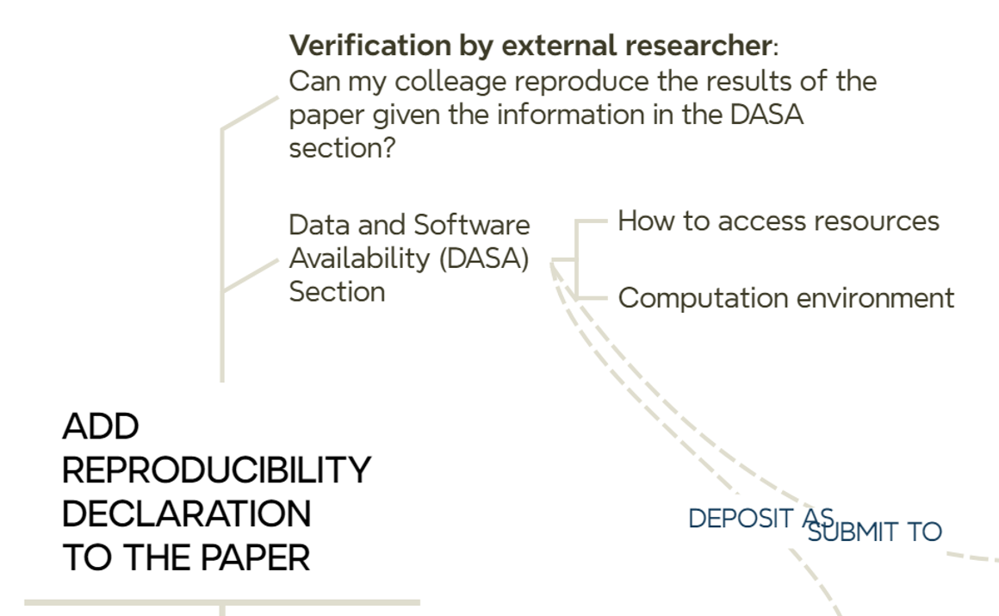{#fig-roadmap-dasa}
:::

## Stop: we deposit preprint at the time of submission

We upload the preprint to [arXiv](https://arxiv.org/), [SSRN](https://www.ssrn.com/index.cfm/en/) or [EarthArXiv](https://eartharxiv.org/) at the time of submission. This does not mean that we need to make double effort: the same file can be uploaded to the preprint server and sent to a journal for peer-review.

::: column-screen-inset-right
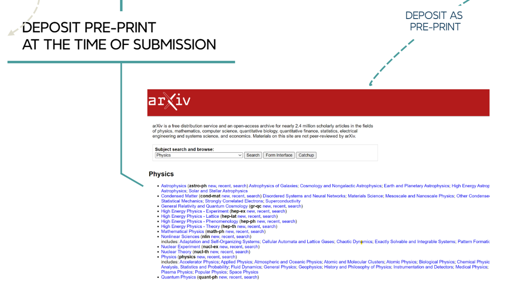
:::

## Reviewers have access to the paper and all relevant resources

The process of reviewing an article often involves several iterations to satisfy reviewers' comments and suggestions (@#fig-roadmap-reviewers). These updates may involve fixing code errors, collecting more data, completing analyses, etc. When all edits are done, we publish new versions of the research code and data resources as we did in the previous steps. Therefore, tagging distinct versions of a GitHub repository helps a lot in case multiple updates occur during the peer review process of an article. Each version in a GitrHub repository is mapped to a version in the associated Zenodo entry. 

We can use either the canonical DOI of a Zenodo entry or the final version used in the article in the resource citation. The canonical DOI represent all versions of a given resource in Zenodo, and will always resolve to the lastest version. For the below resource, we cite the version used in the published article (version v1.0.0-r1, [10.5281/zenodo.12570519](https://doi.org/10.5281/zenodo.12570519)) instead of the canonical DOI ([10.5281/zenodo.7991797](https://doi.org/10.5281/zenodo.7991797)). In this example, both DOIs resolve to the same version of the resource.

> [57] M. Matey-Sanz, “Reproducible Package for “Implementing and evaluating the Timed Up and Go test automation using smartphones and smartwatches”, version v1.0.0-r1, Zenodo, Jun. 2024, [Available in]: [https://doi.org/10.5281/zenodo.12570519](https://doi.org/10.5281/zenodo.12570519).

::: column-screen-inset-right
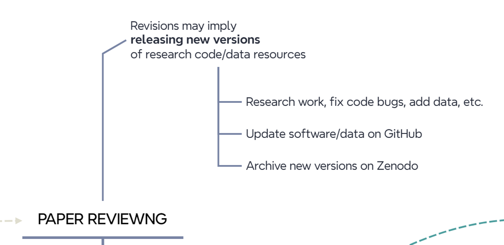{#fig-roadmap-reviewers}
:::

## Stop: we update connected resources once the paper is published

Once a paper is accepted and published, it is recommended to complete the information on archived resources (@fig-roadmap-connected) to enable connectivty between them.

- GitHub: update `README` file to add DOI link to paper, DOI to Zenodo, handler to the posprint deposit, etc.
- Zenodo: update entry to add publications information and related work. 

This allows for bi-directional interconnection between all resources. From the published paper, simply click on the DOI to access the Zenodo entry and, from there, the corresponding GitHub repository. Conversely, you can navigate from the GitHub repository to the Zenodo entry and then to the published paper or the postprint version.

::: column-screen-inset-right
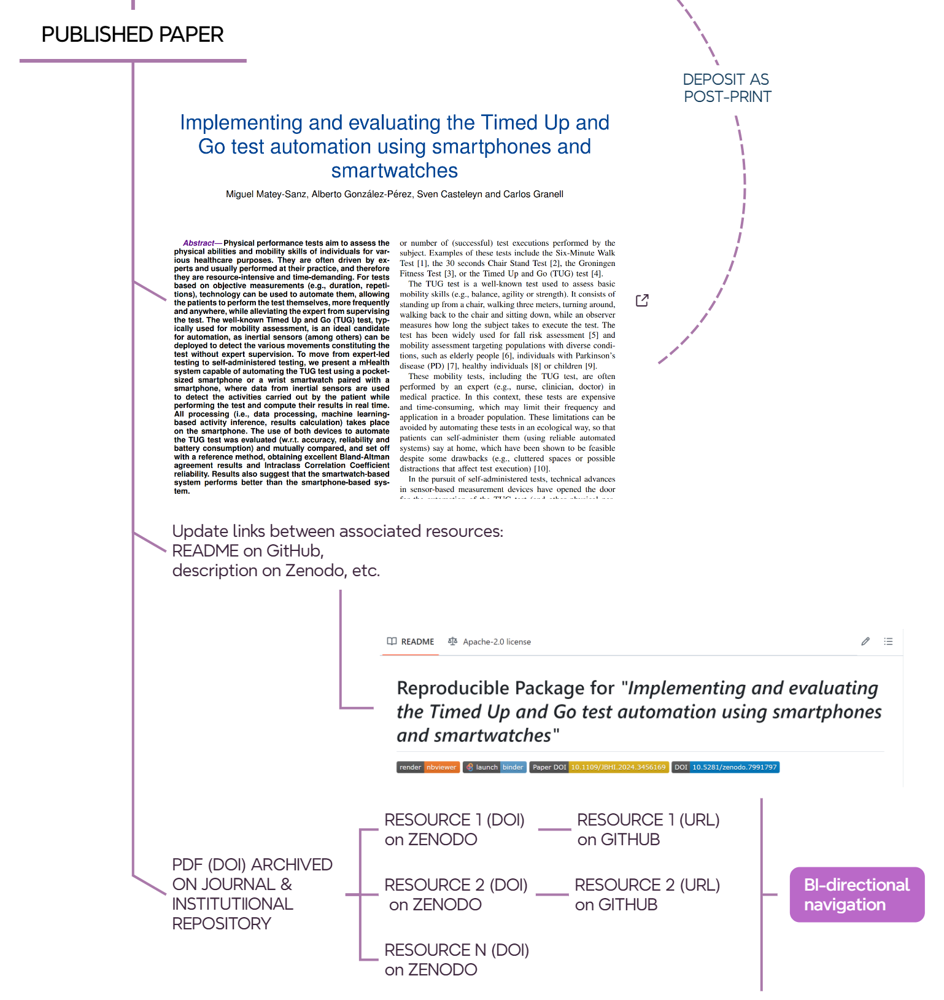{#fig-roadmap-connected}
:::

### Stop: we (library indeed) deposit pre- or post-print in the institutional repository

At UJI, the library requests preprints or postprints of a non-open access article from authors, according to the publisher's terms. In the case of an open access article, the library will deposit the published version in the [institutional repository](https://repositori.uji.es/). For example, this is the [handler](http://hdl.handle.net/10234/691992) of the open access scientific article deposited in the UJI repository. 

::: column-screen-inset-right
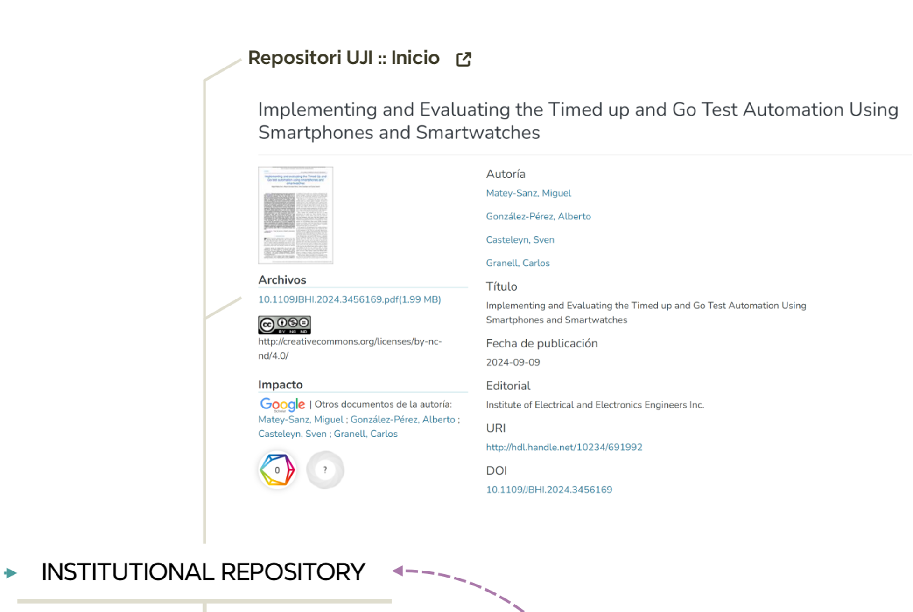{#fig-roadmap-deposit}
:::

## Final stop: end of the road to open science & reproducibility?

@fig-roadmap-end illustrates the full picture. Is this the end of the road? In what ways can we improve? Do new tools affect this workflow? How?

::: column-screen-inset-right
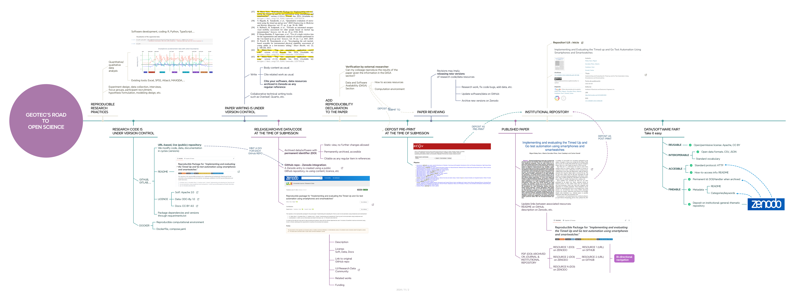{#fig-roadmap-end}
:::

